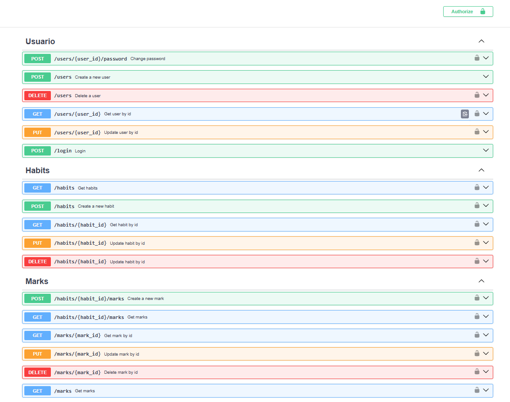

# 🌟 Api control de hábitos | Habits control api

📌 **Enlace a la demo | Live demo link:** [🔗 Ver en Vivo | View Live](https://habits-three-iota.vercel.app/home-page)

---

## 🎯 Sobre este Proyecto | About this Project

### Español:

Esta es una API RESTful construida con **FastAPI** que forma parte de un sistema de gestión de hábitos. La API permite a los usuarios crear, leer, actualizar y eliminar hábitos, así como gestionar las metas asociadas a estos hábitos, mostrando estadísticas de los hábitos registrados.

La API está diseñada para integrarse con una aplicación frontend construida con **React**, que permite a los usuarios realizar peticiones para gestionar sus hábitos y metas de manera intuitiva. ([🔗 Ver repositorio](https://github.com/joaquinn6/habits-app))

_¡Este proyecto no es solo una carta de presentación, sino una muestra real de mis habilidades como desarrollador full-stack!_  

### English:

This is a RESTful API built with **FastAPI** that is part of a habit management system. The API allows users to create, read, update, and delete habits, as well as manage the goals associated with these habits, displaying statistics of the registered habits.

The API is designed to integrate with a frontend application built with **React**, which allows users to make requests to manage their habits and goals intuitively. ([🔗View repository](https://github.com/joaquinn6/habits-app)).

_This project is not just a presentation letter, but a real showcase of my skills as a full-stack developer!_  

---

## 🎥 Vista Previa | Preview 

📸 

---

## ✨ Características Principales | Key Features

### Español:
✅ **Autenticación de usuarios**: Implementación de autenticación basada en `JWT`.
✅ **Gestión de hábitos**: Permite agregar, editar y eliminar hábitos.
✅ **Metas asociadas**: Los hábitos pueden tener metas asignadas para su seguimiento.
✅ **Seguridad**: Implementación de seguridad usando `python-jose` para manejo de `JWT` y `passlib` para la seguridad de contraseñas.
✅ **Generación de estadísticas**: Uso de agregaciones en `MongoDB` para generar reportes y gráficos sobre el progreso de los hábitos.

### English:
✅ **User authentication**: Implementation of `JWT-based` authentication.
✅ **Habit management**: Allows adding, editing, and deleting habits.
✅ **Associated goals**: Habits can have assigned goals for tracking.
✅ **Security**: Security implementation using `python-jose` for JWT handling and `passlib` for password security.
✅ **Statistics generation**: Use of aggregations in `MongoDB` to generate reports and graphs on habit progress.

---

## 🛠 Tecnologías Utilizadas | Technologies Used

- FastAPI  
- MongoDB  
- Pydantic
- Docker

### **Despliegue | Deployment:**
- Render  

---

## 📬 Contacto | Contact

- **📧 Email:** joaquin.software.e@gmail.com  
- **💼 LinkedIn:** [Mi LinkedIn](https://www.linkedin.com/in/joaquin-n6/)  
- **🐙 GitHub:** [Mi GitHub](https://github.com/joaquinn6)  

---

## 📜 Licencia | License 
### Español:  
📄 Este proyecto está bajo la licencia **MIT**. Siéntete libre de usarlo, modificarlo y compartirlo.  

### English:  
This project is licensed under the **MIT** license. Feel free to use, modify, and share.  
